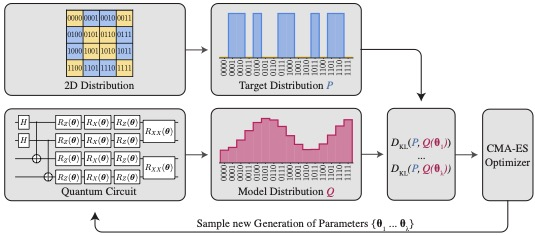
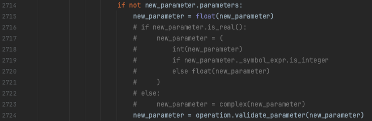

[](https://opensource.org/licenses/MIT)
[](https://codecov.io/gh/cda-tum/mqt-predictor)
[](https://mqt.readthedocs.io/projects/predictor)

<p align="center">
<picture>
  <source media="(prefers-color-scheme: dark)" srcset="https://raw.githubusercontent.com/cda-tum/mqtpredictor/main/docs/_static/mqt_light.png" width="60%">
  
</picture>
</p>

# Towards Application-Aware Quantum Circuit Compilation

This branch contains the source code to run the experiments described in the paper
"Towards Application-Aware Quantum Circuit Compilation".

## Considered Problem

Due to the variety of different available compilers and proposed compilation schemes, the respectively compiled quantum circuits also significantly differ, e.g., in terms of the number of gates, the mapping of logical to physical qubits, and the induced overhead by adhering to a device's restricted connectivity.
Although all compiled quantum circuits represent the same functionality and should lead to the same solutions to the application considered, this is not the case in reality due to the imperfection of the currently available _Noisy Intermediate Scale Quantum_ (NISQ) computers.

This raises the question of how to evaluate the quality of a compilation scheme.
To this end, different metrics acting as _figures of merit_ have been proposed to compare compilation schemes.
Those figures of merit try to resemble how well a compiled circuit can be executed on a quantum computer and, by that, act as a _proxy_ for the solution quality of the considered application.
These figures of merit can be grouped into three categories with an increasing effort to calculate but also higher resemblance of the actual execution:

1. Figures of merit based on characteristics of the compiled quantum circuit: This includes efficiently computable metrics such as the depth of the compiled circuit or its gate count---frequently limited to the number of two-qubit gates because, for most current architectures, their execution error rate is significantly higher than that of single-qubit gates.
2. Figures of merit based on the characteristics of the compiled quantum circuit _and_ quantum device: Here, information such as specific gate error rates and qubit decoherence times are also considered, e.g., in the _expected fidelity_ and the _estimated success probability_.
3. Figures of merit based on the comparison of (noiseless) simulations and actual execution results of the compiled quantum circuit: When executed both on a noiseless simulator and on an actual quantum device, the overlap in the resulting histograms can be compared. The compilation scheme leading to the largest overlap is selected as the most promising one.

In this work, a different approach is explored: instead of defining a _proxy_ for the expected solution quality of a considered application and using this as the figure of merit during compilation, the solution quality of the application _itself_ is used---offering the potential to further increase the solution quality for a considered application.

Realizing such an _application-aware_ compilation scheme for a considered application requires two steps: An application-aware figure of merit must be defined and a compilation environment must be set up that supports customizable figures of merit.
To this end, a running example of an industy-inspired application is used for illustrative purposes, which is introduced first.

## Running Example: Quantum Generative Modeling

Generative learning is experiencing rapid growth and attracting widespread interest across industries, with applications extending from anomaly detection to text and image generation, as well as speech and video synthesis.
Ultimately, the objective of training a generative model is to express the underlying distribution of a dataset using a machine learning model.
In _quantum generative learning_, this model is represented by a parameterized quantum circuit.

A _Quantum Circuit Born Machine_ (QCBM) is a quantum generative model that is trained to learn a target distribution:

<p align="center">
<picture>
  
</picture>
</p>

In this case, the distribution of a two-dimensional dataset that resembles the letter X (indicated by the orange tiles)---the parameter values of the shown parameterized quantum circuit are adjusted so that the resulting model distribution comes as close as possible to the target distribution.

## Application-Aware Figure of Merit

During the QCBM training, the deviation of the model distribution Q to the target distribution P shall be minimized.
This difference is determined using the Kullback-Leibler (KL) divergence:

$$D_{\mathrm{KL}}(P \| Q)=\sum_{x \in \mathcal{X}} P(x) \log \left(\frac{P(x)}{Q(x)}\right)$$

Whenever the KL divergence reaches its minimum, the training is completed and the lower it is, the better the model is trained.
Therefore, it is a suitable candidate for the _application-aware figure of merit_ in this exemplary application.
To minimize the KL divergence, the model parameters are adapted via the covariance matrix adaption evolutionary strategy (CMA-ES), a gradient-free optimizer.

## Compilation Environment

To compile the underlying quantum circuit of the QCBM application for the KL divergence as its application-aware figure of merit, the MQT Predictor framework has been adapted accordingly.
By providing the quantum circuit of the considered application, such as, e.g., an application instance with $4$ qubits as shown above, the framework over time learns the most efficient combination of compilation passes that leads to the highest solution quality---while, during the training, the application itself is run for each determined sequence of compilation passes.

## Run the Experiments to Reproduce the Results

All Python packages and their used version are listed in the `requirements.txt` file and can be installed by running:

```console
pip install -r requirements.txt --no-dependencies
pip install . --no-dependencies
```

Note: In the `qiskit.circuit.quantumCircuit.py` file, a small modification is necessary to run the experiments:

<p align="center">
<picture>
  
</picture>
</p>

Please comment out the lines as shown in the image above and substitute them by `new_parameter = float(new_parameter)`.

The following code gives an example how to compile the application using the MQT Predictor framework.

```console
python3 application_aware_compilation.py --num_qubits 4 --dev ibm_quito
```

To create the baseline results, run:

```console
python3 quantum_generative_modeling.py --num_qubits 4 --opt 1 --num_runs 25
python3 quantum_generative_modeling.py --num_qubits 4 --opt 3 --num_runs 25
```

Afterwards, the plots of the paper can be generated by running the jupyter notebook in `evaluations/evaluation_application_aware_compilation.ipynb`.

## Reference

In case you are using this work, we would be thankful if you referred to it by citing the following publication:

```bibtex
@inproceedings{quetschlich2024application_compilation,
    title      = {{Towards Application-Aware Quantum Circuit Compilation}},
    author     = {N. Quetschlich and F. J. Kiwit and M. A. Wolf and C. A. Riofrio and A. Luckow and L. Burgholzer and R. Wille},
    booktitle  = {IEEE International Conference on Quantum Software (QSW)},
    year       = {2024},
    eprint     = {2404.12433},
    eprinttype = {arXiv},
}
```

which is also available on arXiv:
[](https://arxiv.org/abs/2404.12433).

## Disclaimer

This branch will not receive further update or maintenance. The latest version of the MQT Predictor framework can be found in the `main` branch.

## Acknowledgements

The Munich Quantum Toolkit has been supported by the European
Research Council (ERC) under the European Union's Horizon 2020 research and innovation program (grant agreement
No. 101001318), the Bavarian State Ministry for Science and Arts through the Distinguished Professorship Program, as well as the
Munich Quantum Valley, which is supported by the Bavarian state government with funds from the Hightech Agenda Bayern Plus.

<p align="center">
<picture>
<source media="(prefers-color-scheme: dark)" srcset="https://raw.githubusercontent.com/cda-tum/mqt-predictor/quantum_generative_modeling/docs/_static/tum_dark.svg" width="28%">

</picture>
<picture>

</picture>
<picture>
<source media="(prefers-color-scheme: dark)" srcset="https://raw.githubusercontent.com/cda-tum/mqt-predictor/quantum_generative_modeling/docs/_static/erc_dark.svg" width="24%">

</picture>
<picture>

</picture>
</p>
