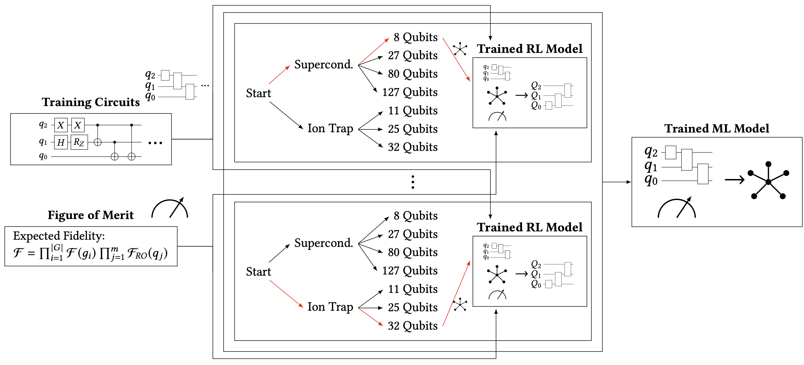
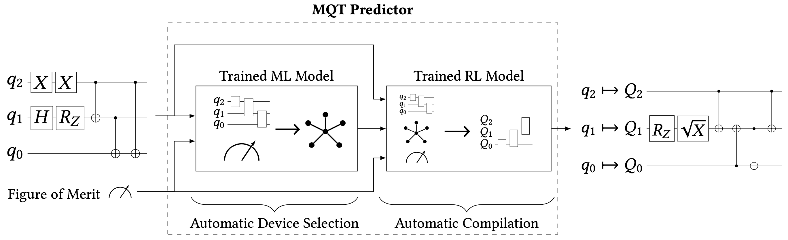

[](https://opensource.org/licenses/MIT)
[](https://github.com/cda-tum/mqt-predictor/actions/workflows/coverage.yml)
[](https://github.com/cda-tum/mqt-predictor/actions/workflows/deploy.yml)
[](https://codecov.io/gh/cda-tum/mqt-predictor)
[](https://mqt.readthedocs.io/projects/predictor)

<p align="center">
<picture>
  <source media="(prefers-color-scheme: dark)" srcset="https://raw.githubusercontent.com/cda-tum/mqtpredictor/main/docs/_static/mqt_light.png" width="60%">
  
</picture>
</p>

# MQT Predictor: Automatic Device Selection with Device-Specific Circuit Compilation for Quantum Computing

MQT Predictor is a framework that allows one to automatically select a suitable quantum device for a particular application and provides an optimized compiler for the selected device.
It not only supports end-users in navigating the vast landscape of choices, it also allows to mix-and-match compiler passes from various tools to create optimized compilers that transcend the individual tools.
Evaluations on more than 500 quantum circuits and seven devices have shown that—compared to Qiskit's and TKET's most optimized compilation flows—the MQT Predictor yields circuits with an expected fidelity that is on par with the best possible result that could be achieved by trying out all combinations of devices and compilers and even achieves a similar performance when considering the critical depth as an alternative figure of merit.

Therefore, MQT Predictor tackles this problem from two angles:

1. It provides a method (based on Reinforcement Learning) that produces device-specific quantum circuit compilers by combining compilation passes from various compiler tools and learning optimized sequences of those passes with respect to a customizable figure of merit). This mix-and-match of compiler passes from various tools allows one to eliminate vendor locks and to create optimized compilers that transcend the individual tools.

2. It provides a prediction method (based on Supervised Machine Learning) that, without performing any compilation, automatically predicts the most suitable device for a given application. This completely eliminates the manual and laborious task of determining a suitable target device and guides end-users through the vast landscape of choices without the need for quantum computing expertise.

<p align="center">
<picture>
  
</picture>
</p>

In the following, we provide a brief overview of the two approaches.

## Device-specific Quantum Circuit Compiler Using Reinforcement Learning Model

Compilation, fortunately, is not new per-se, since classical compilers have seen a similar trend of an increasing complexity and variety in the past.
To not reinvent the wheel and make use of the decades of classical compiler optimization, quantum compilation is modeled in a similar fashion and classical reinforcement learning is used to predict compilation pass sequences optimizing for the chosen figure of merit.

Through distinct constraints and a unifying interface, the framework supports the combination of techniques
from different compilers and optimization tools in a single compilation flow.
The compilation process is modelled as a Markov Decision Process and takes three inputs:

1. Training circuits
2. The targeted quantum device
3. The figure of merit to optimize for

<p align="center">
<picture>
  
</picture>
</p>

The trained reinforcement learning model then acts as a compiler and can be used to compile any quantum circuit for the targeted device.

In this implementation, compilation passes from both IBM's Qiskit and Quantinuum's TKET are utilized for the RL training
of the optimized compiler.
We trained one RL model for each currently supported quantum device:

- OQC Lucy with 8 qubits
- IonQ Harmony with 11 qubits
- IonQ Aria1 with 25 qubits
- IBM Montreal with 27 qubits
- Quantinuum H2 with 32 qubits
- Rigetti Aspen-M2 with 80 qubits
- IBM Washington with 127 qubits

## Automatic Device Selection Using Supervised Machine Learning

A naive approach to select the best quantum device for a given quantum circuit would be to compile it for all devices, e.g., using the trained RL models which act as specialized compilers for supported quantum devices.
Afterwards, the resulting compiled circuits must be evaluated according to some figure of merit to identify the most promising device.
However, doing this for each and every to-be-compiled quantum circuit is practically infeasible since compilation is a time-consuming task.

The MQT Predictor learns from previous compilations of other quantum circuits and models the problem of determining the most promising device for a circuit and figure of merit as a statistical classification task—a task well suited for supervised machine learning.
For that, the framework is trained with a set of quantum circuits and their respective compilation options for all supported devices for a given figure of merit:

<p align="center">
<picture>
  
</picture>
</p>

The trained model then acts as a predictor and can be used to predict the most suitable device for a given quantum circuit and figure of merit.

For evaluation of our methodology, seven supervised machine learning classifiers have been used:

- Random Forest
- Gradient Boosting
- Decision Tree
- Nearest Neighbor
- Multilayer Perceptron
- Support Vector Machine
- Naive Bayes

In our exemplary scenario, the Random Forest classifier achieved the best performance.

# The MQT Predictor framework: Automatic device selection and optimized compilation

From a user's perspective, the framework is used as follows:

<p align="center">
<picture>
  
</picture>
</p>

Any uncompiled quantum circuit can be provided together with the desired figure of merit.
The framework then automatically predicts the most suitable device for the given circuit and figure of merit and compiles the circuit for the predicted device.
The compiled circuit is returned together with the compilation information and the selected device.

# Usage

First, the package must be installed:

```console
(venv) $ pip install mqt.predictor
```

Now a prediction can be made for any `qiskit.QuantumCircuit` object or `qasm` file:

```python
from mqt.predictor import qcompile

compiled_qc, compilation_info, selected_device = qcompile(
    "qasm_file_path_or_QuantumCircuit", figure_of_merit="expected_fidelity"
)
```

Currently available figures of merit are `fidelity` and `critical_depth`.

# Examination of all seven trained classifiers of the ML model

To play around with all the examined models, please use the `notebooks/ml/evaluation.ipynb` Jupyter notebook.

## Adjustment of training data generation process

The adjustment of the following parts is possible:

### Evaluation Metric

To make predictions which compilation options are the best ones for a given quantum circuits, a goodness definition is needed.
In principle, this evaluation metric can be designed to be arbitrarily complex, e.g., factoring in actual costs of executing quantum circuits on the respective platform or availability limitations for certain devices.
However, any suitable evaluation metric should, at least, consider characteristics of the compiled quantum circuit and the respective device.
An exemplary metric could be the overall fidelity of a compiled quantum circuit for its targeted device.

### Generation of Training Data

To train the model, sufficient training data must be provided as qasm files in the `./training_samples_folder`.
We provide the training data used for the pre-trained model.

After the adjustment is finished, the following methods need to be called to generate the training data:

```python
from mqt.predictor import ml

predictor = ml.Predictor()
predictor.generate_compiled_circuits(figure_of_merit="expected_fidelity")
training_data, name_list, scores_list = predictor.generate_trainingdata_from_qasm_files(
    figure_of_merit="expected_fidelity"
)
ml.helper.save_training_data(
    training_data, name_list, scores_list, figure_of_merit="expected_fidelity"
)
```

Now, the Random Forest classifier can be trained:

```python
predictor.train_random_forest_classifier(figure_of_merit="expected_fidelity")
```

Additionally, the raw training data may be extracted and can be used for any machine learning model:

```python
training_data = predictor.get_prepared_training_data(
    save_non_zero_indices=True, figure_of_merit="expected_fidelity"
)
```

# Repository Structure

```
.
├── docs/
├── notebooks/
│ ├── evaluations/
│ │     ├── ...
│ └── example.ipynb
├── src/
│ ├── mqt/
│   └── predictor/
│     ├── calibration_files/
│     ├── ml/
│     │ └── training_data/
│     │     ├── trained_model
│     │     ├── training_circuits
│     │     ├── training_circuits_compiled
│     │     └── training_data_aggregated
│     └── rl/
│          └── training_data/
│              ├── trained_model
│              └── training_circuits
```

# References

The MQT Predictor is based on the following publications:

```bibtex
@MISC{quetschlich2023mqtpredictor,
	AUTHOR      = {N. Quetschlich and L. Burgholzer and R. Wille},
	TITLE       = {{MQT Predictor: Automatic Device Selection with Device-Specific Circuit Compilation for Quantum Computing}},
	YEAR        = {2023},
	EPRINT      = {2305.02337},
	EPRINTTYPE  = {arxiv},
}
```

which is available on arXiv:
[](https://arxiv.org/abs/2310.06889)

```bibtex
@INPROCEEDINGS{quetschlich2023prediction,
	AUTHOR    = {N. Quetschlich and L. Burgholzer and R. Wille},
	TITLE     = {{Predicting Good Quantum Circuit Compilation Options}},
	BOOKTITLE = {IEEE International Conference on Quantum Software (QSW)},
	YEAR      = {2023},
}
```

which is also available on arXiv:
[](https://arxiv.org/abs/2210.08027)

```bibtex
@INPROCEEDINGS{quetschlich2023compileroptimization,
  author        = {N. Quetschlich and L. Burgholzer and R. Wille},
  title         = {{Compiler Optimization for Quantum Computing Using Reinforcement Learning}},
  booktitle     = {{Design Automation Conference (DAC)}},
  year          = {2023},
}
```

which is also available on arXiv:
[](https://arxiv.org/abs/2212.04508)
